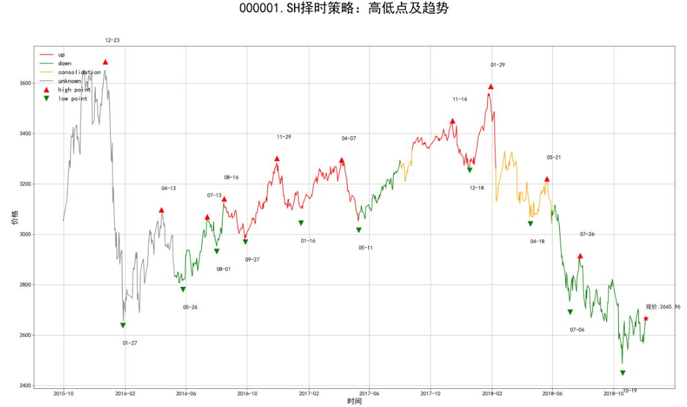
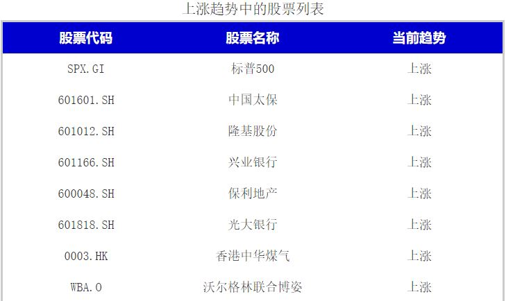

# Winfor-BStrend
<font face="微软雅黑" size=2>**写在前面**：如果您正在使用github浏览本markdown文件，本文件中的数学公式渲染可能不能正常显示。推荐使用Chrome浏览器，并在Chrome的应用商店，下载[MathJax Plugin for Github](https://chrome.google.com/webstore/detail/mathjax-plugin-for-github/ioemnmodlmafdkllaclgeombjnmnbima/related)插件。</font>

&emsp;&emsp;BStrend属于<b>*BS系列*</b>项目的分支，简化了主程序的一部分功能，并主要用于回测和在日K线的级别上对于股票趋势的更新和报告。本项目基于Python语言开发，要求版本在3.6及以上，打包的可执行文件适用于Windows操作系统。本项目的主要设计组件包括如下部分：
+ **策略设计**：核心策略算法为高低点算法和基于高低点之上测趋势算法。本项目中的`高低点`与``趋势``继承主程序的定义及算法，在之后部分（[1.1高低点](#11高低点)）会予以说明。
+ **数据来源**：本项目对于股票历史数据存在较频繁的读写和遍历。数据主要为股票在回测阶段的收盘价、最高价与最低价，通过Wind数据库的量化接口API导入。
+ **数据存储**：本项目并不直接存储原始股票历史数据，而是将回测后的主要结果（历史高低点，以及当前策略运行产生的中间运算结果）存储在`sqlite`这一python轻量级数据库中；并在之后的每日运行中通过读取数据库获取股票的策略历史运算记录，并结合当前最新数据（当日最高价、最低价及收盘价）进行运算结果的更新，将更新结果写入数据库覆盖之前结果。
+ **图像绘制**：本项目的图像可视化基于`matplotlib.pyplot`这一python二维科学绘图常用工具包，仅在股票回测结束和之后股票趋势发生更新的当日收盘后会更新图像，图像包含了股票截止目前的高低点信息、历史趋势类型。由于图像绘制较为耗时且占用内存较高，因此设置了只绘制部分回测图像的控制参数以节约时空成本。具体设置请见后续部分。
+ **任务调度**：本项目中的任务调度框架采用`APschedular`，主要任务为交易日定时工作及运行日志管理。以A股市场交易时间为基准，用户可设定在每日收盘后（应当考虑到港股收盘时间较晚和WIND数据库数据更新需要一定延迟时间），设定当日更新全体股票的时刻，调度会记录任务堆栈中的定时，并在指定时间触发任务执行的信号。
+ **自动发信**：用户可选择“每日发信”模式和仅当有目标股票发生趋势改变时发信两种模式。美股信息单独发信，A股和港股合并发信。发信内容会提示股票变动，以及基准市场指数的趋势及图像，当前所有股票的趋势类型。
<!-- TOC START min:1 max:6 link:true update:false -->
- [Winfor-BStrend](#winfor-bstrend)
  - [1.策略设计](#1策略设计)
    - [1.1高低点](#11高低点)
    - [1.2趋势](#12趋势)
    - [1.3高低点和趋势的初始化设定](#13高低点和趋势的初始化设定)
  - [2.用户导引](#2用户导引)
    - [2.1文件配置](#21文件配置)
    - [2.2参数释义](#22参数释义)
    - [2.3发信内容](#23发信内容)
  - [3.开发者说明](#3开发者说明)
    - [3.1调用关系](#31调用关系)
    - [3.2模块功能](#32模块功能)

<!-- TOC END -->


### 1.策略设计
#### 1.1高低点
&emsp;&emsp;需要明确的是，高点和低点是间隔交叉出现的。在文档及代码中，请注意以下表示高低点的用语指向同一意思表示：


|             高点             |  高点index |             低点             |  低点index |
|:----------------------------:|:----------:|:----------------------------:|:----------:|
| H,h, hpoint, Hpoint highpoint | hindex, hpi | L，l, lpoint, Lpoint lowpoint | lindex lpi |

**高点**
> i）前低点已确认的情况下，回调达到`THRESH_D`个交易区间单位时，确认此区间的最高点为当前级别高点  
ii）前低点已确认的情况下，回调幅度超过前`AVG_N`次回调的均值（可选`AVG_BUFFER`），确认当前区间最高点为当前级别高点  
iii）前低点已确认的情况下，回调跌破前低点，即确认当前区间最高点为当前级别高点。  

**低点**
> i）前高点已确认的情况下，上涨达到`THRESH_D`个交易区间单位时，确认此区间的最低点为当前级别低点  
ii）前低点已确认的情况下，上涨幅度超过前`AVG_N`次上涨的均值（可选`AVG_BUFFER`），确认当前区间最低点为当前级别低点  
iii）前低点已确认的情况下，上涨超过前高点，即确认当前区间最低点为当前级别低点。  
#### 1.2趋势
&emsp;&emsp;本项目中定义三种趋势类型：
* `up`上升趋势
* `down`下跌趋势
* `consd`盘整趋势

**上涨**
> *上涨趋势的确认*：
i）出现连续两个低点抬高和高点抬高  
 $h_i,l_i,h_{i+1},l_{i+1};h_{i+1}>h_{i}, l_{i+1}>l_{i} $  
 $l_i,h_i,l_{i+1},h_{i+1};l_{i+1}>l_{i},;h_{i+1}>h_{i}$  
 ii）当最高点距离前日线低点`TREND_REV`个交易日时，则确认为日线上涨趋势  
*上涨趋势的延续*：低点依次抬高  
*上涨趋势结束*：  
i）转入盘整趋势  
 $h_i,l_i,h_{i+1},l_{i+1};h_{i+1}>h_{i} \ and \ l_{i+1}<l_i$  
 ii）转入下跌趋势  
 $h_i,l_i,h_{i+1},l_{i+1};h_{i+1}<h_i \ and \ l_{i+1}<l_i$  

 **下跌**
 > *下跌趋势的确认*：  
 i）出现连续两个低点降低和高点降低  
  $h_i,l_i,h_{i+1},l_{i+1};h_{i+1}<h_{i} \ and\ l_{i+1}<l_{i} $  
  $l_i,h_i,l_{i+1},h_{i+1};l_{i+1}<l_{i}\ and\ h_{i+1}<h_{i}$  
  ii）当最低点距离前日线低点`TREND_REV`个交易日时，则确认为日线下跌趋势  
 *下跌趋势的延续*：高点依次降低  
 *下跌趋势结束*：  
 i）转入盘整趋势  
  $h_i,l_i,h_{i+1},l_{i+1};h_{i+1}<l_{i},l_{i+1}>l_i$  
  ii）转入上涨趋势  
  $h_i,l_i,h_{i+1},l_{i+1};h_{i+1}>h_i,l_{i+1}>l_i$  

  **盘整**
  > *盘整趋势的确认*：  
  > 由以上上涨趋势和下跌趋势确认转入盘整趋势的  
  在序列最初高低点较少时，无法被归类于上涨或下跌趋势的，暂时归类为盘整趋势  
  *盘整趋势的结束*：满足上涨或下跌趋势的确认定义，结束盘整趋势而转入上涨或下跌趋势。  

#### 1.3高低点和趋势的初始化设定
&emsp;&emsp;在回测时，需要解决在遍历数据列表之前对于高低点和趋势的初始化问你。由于策略算法基于迭代规则，因此初值是必要的。初始化的原则是尽可能耗费较少的数据选择出合适的初值。幸运的是，当回测时期较长的时候，初值对于之后策略表现（主要是判断准确度）的影响会渐渐衰减。  
<b>*高低点的初始化设定*</b>
&emsp;&emsp;从序列首开始遍历日线数据，如果找到第一个分型类型是底分型，那么设该底K线为待判定低点，转而进入低点判定分支；如果第一个分型是顶分型，那么设定该顶K线为待判定高点，转而进入高点判定分支。关于分型的具体定义如下：
> *顶分型*：  
$K_{i-1}.h\le K_i.h\ and\ K_i.h\ge K_{i+1}.h \ and \ not \ K_{i-1}.h=K_i.h=K_{i+1}.h:称K_i$为该顶分型的顶
*底分型*：  
$K_{i-1}.l\ge K_i.l\ and\ K_i.l\le K_{i+1}.l\ and \ not \ K_{i-1}.l=K_i.l=K_{i+1}.l:称K_i$为该底分型的底

<b>*趋势的初始化设定*</b>  
&emsp;&emsp;趋势判别在回测算法中需要在遍历数据列表判定完回测区间内所有高低点后进行。趋势初始化需要至少确认4个高点或低点，枚举所有组合可能：
- $l_0, h_0, l_1, h_1; l_1>l_0\Rightarrow$`up`
- $l_0, h_0, l_1, h_1; l_1<l_0\Rightarrow$`consd`
- $h_0, l_0, h_1, l_1; h_0<h_1\Rightarrow$`down`
- $h_0, l_0, h_1, l_1; h_0>h_1\Rightarrow$`consd`
此外在第4个高点或者低点被确认之前的K线趋势都设置为确实类`None`。

### 2.用户导引
#### 2.1文件配置
&emsp;&emsp;用户使用本程序，可直接运行`monitor_s.exe`可执行程序，不需要本地python环境，但是以下支持文件务必完成配置。
- 下载`monitor_s.exe`到本地任意路径 ./directory/BStrend。
- 在同一文件夹下，新建`WindPy.pth`文件，并在文件中写入本机Wind安装地址，例如`C:\Wind\Wind.NET.Client\WindNET\x64`
- 进入Wind界面，在量化接口中修复python插件
- 在`.txt`文件中，第一列写入需要进行回测的Wind股票代码
- 下载config.conf到./directory/BStrend，直接在文件中修改对应的参数，注意注释中的解释和格式要求，并保存。参数具体含义请参考之后具体释义
#### 2.2参数释义
&emsp;&emsp;参数的格式和具体含义可以参照`config.conf`文件中的注释行和例子进行设定，包含所有开放给用户自定义的参数。这里进行详细的说明：
+ `begin_date`：格式'yyyy-mm-dd'，回测开始的日期，不一定要求当天是交易日。在日线趋势策略中，不会用到分钟级别的数据，因此对于日期没有较强的要求。
+ `end_date`：格式'yyyy-mm-dd'，回测结束时间，实际在本项目运行时不会被使用。因为本项目默认回测是用于为之后的每日更新状态提供中间运算结果，因此在调用回测部分是，回测结果默认是策略运行当日。
+ `paint`：控制回测多只股票时的绘图参数。根据希望输出的图像，接受以下格式的参数：
  a.`''`空字符串表示不在回测中绘制任何股票的图像  
  b.`'n'`表示仅绘制和输出前n只股票的图像  
  c.`'m:n'`表示绘制和输出第m只到第n只股票的图像  
  d.`'XXXXXX.SZ;XXXXXX.SH'`用`;`分隔具体的股票代码，输出对应股票代码的图像，当然该代码必须出现在加入回测的`.txt`文件中  
+ `thresh_d`：int类型，表示日线高低点结构确认的最小间隔。一般设置为13.
+ `avg_n`：int类型，在高低点确认的第ii)条判定条件中，取前`avg_n`次上涨或回撤的幅度做参考。如果当前尚未出现`avg_n`次上涨或回撤，那么这个判定条件不起作用。默认值取3。
+ `avg_buffer`：int或float类型，在`avg_n`次上涨或回调的均值基础上做一定的调整，以此结果作为当前高点或低点判定的参考。例如，当前待判定低点，待判定低点的价位为$l_0$，从待判定低点到当前区间内的最高价为$h$，设定`avg_n`=3，前3次上涨的幅度（指从低点到紧接着的高点的涨幅大小）分别为$u_1,u_2,u_3$，那么如果$\frac{h-l_0}{l_0}>\frac{u_1+u_2+u_3}{3}*$`avg_buffer`，即可确认当前待判定低点为低点。默认`avg_buffer`为1，即不对均值做调整。
+ `trend_rev`：int类型，适用上涨/下跌趋势的确认第ii)条准则。例如，当前处于下跌或盘整趋势，并且最近一个确认的高低点类型为低点，那么在被确认的低点当天至当前的区间内最高点的时间超过`trend_rev`个交易日，即可判定上涨趋势成立。反之，如果当前处于上涨或盘整阶段，并且最近一个确认的高低点类型为高点，那么在被确认高点当天至当前的区间内最低点当天的时间间隔超过`trend_rev`个交易日，即可判定下跌趋势成立。
+ `sender`：完整邮箱地址字符串，注意发信邮箱当前支持的邮箱地址后缀包括 163.com | winforcap.com | nedugroup.com | sina.com | sohu.com | 126.com | qq.com | hotmail.com | gmail.com | foxmail.com
+ `sender_key`：发信邮箱的密码字符串
+ `receiver`：接受邮件的收信人邮箱地址，多个邮件地址用;进行分隔
+ `freq`：int类型，发送邮件的频率设定。设定为1则仅在运行当天出现至少一只股票趋势变化时发送邮件，否则不发送邮件；设定为0则在运行当天不管是否出现趋势变化都会发送邮件。
+ `set_t`：当天运行策略，或发送邮件的时间（策略运行需要一定时间，预计实际邮件发送时间会比设定的时间稍晚几分钟）。
+ `code_file`：文件地址字符串（绝对路径），指定待回测股票文件的绝对路径，目前仅设定接受`.txt`文件类型
+ `work`：文件夹地址字符串，即管理该项目工作内容的文件夹地址，建议将输入文件、输出图像文件和数据库文件都设为该文件夹下的子文件（夹）。
+ `database`：数据库地址字符串（绝对路径），注意==如果更换了待回测股票内容，应当同时修改数据库名称，否则将会覆之前股票样本的运行结果记录==。本项目默认一个数据库对应管理一个股票样本池，不能够同时管理多个股票样本池（除了合并其为一个）。如果需要分开管理不同股票样本池，可以多次运行策略，并在每次运行策略前，更改`config.conf`文件，并注意运行结果的隔离。从数据安全的角度，<font color="red">并不建议这样做</font>。
+ `graph`：文件夹地址字符串（绝对路径），回测图像，及运行中产生的趋势变化后所重绘的更新图像文件存放文件夹地址。

#### 2.3发信内容
&emsp;&emsp;A股和港股的变动信息合并发信，用户将会收到邮件标题为“*趋势策略变动报告-A股、港股*”的邮件，内容包括
+ 趋势改变股票列表，eg.

+ 基准市场指数回测以来趋势变动图，eg.

+ 发生趋势改变的股票的趋势变动图
+ 所有处在上涨趋势中的股票列表，eg.

+ 所有处在下跌趋势中的股票列表
+ 所有处在盘整趋势中的股票列表

&emsp;&emsp;美股的变动信息单独发信，用户将会收到邮件标题为“*趋势策略变动报告-美股*”的邮件。其内容和结构同上。

### 3.开发者说明
&emsp;&emsp;本项目开发基于Python3.6及以上版本，Project包含10个python文件和一个`config.conf`文件。main函数入口为`monitor_s.py`文件。运行Project需要载入以下packages:  <font face="Times New Rome">WindPy | apschedular | sqlite3 | os | logging | datetime | numpy | locale | pandas | matplotlib | time| dateutil | copy | re | smtplib | email | premailer<font>。

#### 3.1调用关系
&emsp;&emsp;项目内完整调用关系如下：
```python
reset_params() (constant)
set_triggers() (monitor_s)
Monitor.__init__(self) (Monitor in monitor_s)
    Monitor.runIn(self) (Monitor in monitor_s)
        indexTop(pre_list, fix) (monitor_s)
Monitor.check_dir(self) (Monitor in monitor_s)
Monitor.init(self) (Monitor in monitor_s)
    create_Strategy(tup_list, conn) (sqlite_s)
    code_helper(codename, rev=False) (sqlite_s)
    runbacktest(begin=BEGIN_DATE, codename="600519.SH", dir=GRAPH, end=END_DATE, paint=True, star=False) (graph)
        loadData_daily(begin_date=BEGIN_DATE, stockname='600519.SH', end_date=END_DATE) (loadData)
            loaddataError.__init__(self, msg) (loaddataError in loadData)
            Kti.__init__(self, n_30=N_30, *i) (Kti in defindex)
            K.__init__(self, high, low, close, i, lev, time, dhl="") (K in K)
        HLPoint.__init__(self, klist, code, thresh=THRESH_D) (HLPoint in hlPoint)
        HLPoint.init_hl(self) (HLPoint in hlPoint)
        HLPoint.get_hl(self) (HLPoint in hlPoint)
            HLPoint.step_hl(self, wait_thresh=WAIT_DTO30) (HLPoint in hlPoint)
                HLPoint.l2h(self) (HLPoint in hlPoint)
                HLPoint.h2l(self) (HLPoint in hlPoint)
        Trend.__init__(self, hlp_env) (Trend in trend)
        Trend.get_trend(self) (Trend in trend)
            Trend.init_trd(self) (Trend in trend)
                TrendError.__init__(self, msg="Undecidable trend; Need more high or low points to decide trend") (TrendError in trend)
            Trend.step_trdmax(self) (Trend in trend)
            Trend.step_trd(self) (Trend in trend)
        BSgraph.__init__(self, hlist, llist, data, note, codename) (BSgraph in graph)
        BSgraph.strategy_info(self, lasthl, space_h, space_l) (BSgraph in graph)
        BSgraph.performance(self, trdchg, dir="", star=False) (BSgraph in graph)
    create_Stock(tup_list, conn, codename) (sqlite_s)
        code_helper(codename, rev=False) (sqlite_s)
Monitor.daily1(self) (Monitor in monitor_s)
    code_helper(codename, rev=False) (sqlite_s)
    HLPoint.step_hl_s(hl, high, low, temp_hl, temp_m, from_hl, from_temp, pre_high, pre_low, use_space, space_h, space_l, l2h, h2l) (HLPoint in hlPoint)
    Trend.step_trdmax_s(hl, low, high, from_temp, from_hl, temp_hl, trd) (Trend in trend)
    Trend.step_trd_s(trd, hl, low, high, pre_low, pre_high, pre2_low, pre2_high) (Trend in trend)
    Monitor.sent(self) (Monitor in monitor_s)
        indexTop(pre_list, fix) (monitor_s)
        runbacktest(begin=BEGIN_DATE, codename="600519.SH", dir=GRAPH, end=END_DATE, paint=True, star=False) (graph)
            loadData_daily(begin_date=BEGIN_DATE, stockname='600519.SH', end_date=END_DATE) (loadData)
                loaddataError.__init__(self, msg) (loaddataError in loadData)
                Kti.__init__(self, n_30=N_30, *i) (Kti in defindex)
                K.__init__(self, high, low, close, i, lev, time, dhl="") (K in K)
            HLPoint.__init__(self, klist, code, thresh=THRESH_D) (HLPoint in hlPoint)
            HLPoint.init_hl(self) (HLPoint in hlPoint)
            HLPoint.get_hl(self) (HLPoint in hlPoint)
                HLPoint.step_hl(self, wait_thresh=WAIT_DTO30) (HLPoint in hlPoint)
                    HLPoint.l2h(self) (HLPoint in hlPoint)
                    HLPoint.h2l(self) (HLPoint in hlPoint)
            Trend.__init__(self, hlp_env) (Trend in trend)
            Trend.get_trend(self) (Trend in trend)
                Trend.init_trd(self) (Trend in trend)
                    TrendError.__init__(self, msg="Undecidable trend; Need more high or low points to decide trend") (TrendError in trend)
                Trend.step_trdmax(self) (Trend in trend)
                Trend.step_trd(self) (Trend in trend)
            BSgraph.__init__(self, hlist, llist, data, note, codename) (BSgraph in graph)
            BSgraph.strategy_info(self, lasthl, space_h, space_l) (BSgraph in graph)
            BSgraph.performance(self, trdchg, dir="", star=False) (BSgraph in graph)
    SendEmail.__init__(self) (SendEmail in email_s)
    SendEmail.buildHTML(self, chg_html, up_html, down_html, consd_html, img_html, stampf) (SendEmail in email_s)
    SendEmail.imageHTML(self, chg_img) (SendEmail in email_s)
    SendEmail.setSend(self, subject, sender, receiver, pwd, sender_name="quant") (SendEmail in email_s)
    Monitor.daily2(self) (Monitor in monitor_s)
        code_helper(codename, rev=False) (sqlite_s)
        HLPoint.step_hl_s(hl, high, low, temp_hl, temp_m, from_hl, from_temp, pre_high, pre_low, use_space, space_h, space_l, l2h, h2l) (HLPoint in hlPoint)
        Trend.step_trdmax_s(hl, low, high, from_temp, from_hl, temp_hl, trd) (Trend in trend)
        Trend.step_trd_s(trd, hl, low, high, pre_low, pre_high, pre2_low, pre2_high) (Trend in trend)
        Monitor.sent(self) (Monitor in monitor_s)
            indexTop(pre_list, fix) (monitor_s)
            runbacktest(begin=BEGIN_DATE, codename="600519.SH", dir=GRAPH, end=END_DATE, paint=True, star=False) (graph)
                loadData_daily(begin_date=BEGIN_DATE, stockname='600519.SH', end_date=END_DATE) (loadData)
                    loaddataError.__init__(self, msg) (loaddataError in loadData)
                    Kti.__init__(self, n_30=N_30, *i) (Kti in defindex)
                    K.__init__(self, high, low, close, i, lev, time, dhl="") (K in K)
                HLPoint.__init__(self, klist, code, thresh=THRESH_D) (HLPoint in hlPoint)
                HLPoint.init_hl(self) (HLPoint in hlPoint)
                HLPoint.get_hl(self) (HLPoint in hlPoint)
                    HLPoint.step_hl(self, wait_thresh=WAIT_DTO30) (HLPoint in hlPoint)
                        HLPoint.l2h(self) (HLPoint in hlPoint)
                        HLPoint.h2l(self) (HLPoint in hlPoint)
                Trend.__init__(self, hlp_env) (Trend in trend)
                Trend.get_trend(self) (Trend in trend)
                    Trend.init_trd(self) (Trend in trend)
                        TrendError.__init__(self, msg="Undecidable trend; Need more high or low points to decide trend") (TrendError in trend)
                    Trend.step_trdmax(self) (Trend in trend)
                    Trend.step_trd(self) (Trend in trend)
                BSgraph.__init__(self, hlist, llist, data, note, codename) (BSgraph in graph)
                BSgraph.strategy_info(self, lasthl, space_h, space_l) (BSgraph in graph)
                BSgraph.performance(self, trdchg, dir="", star=False) (BSgraph in graph)
        SendEmail.__init__(self) (SendEmail in email_s)
        SendEmail.buildHTML(self, chg_html, up_html, down_html, consd_html, img_html, stampf) (SendEmail in email_s)
        SendEmail.imageHTML(self, chg_img) (SendEmail in email_s)
        SendEmail.setSend(self, subject, sender, receiver, pwd, sender_name="quant") (SendEmail in email_s)
Monitor.set_sche(self) (Monitor in monitor_s)
```
具体函数的功能（本markdown文件待完善）请见源代码内的注释，以下主要介绍每个module的实现功能。
#### 3.2模块功能
##### 3.2.1 K
&emsp;&emsp;定义了基本的K线类，封装了K线的基本属性和操作。K线类对象是本项目中最基础的数据储存结构。K线类具有以下基本属性：
```python
      # 以下是单个K线固有属性，不依赖于该K线对象是否处于一个序列中
        self.high = high  # 日K线最高价，float
        self.low = low  # 日K线最低价, float
        self.close = close  #  日K线收盘价, float
        self.i = i  # 日K线索引对象，具体定义请见defindex.py
        self.lev = lev  # 操作级别,int 1->日线 2->30min 3->5min
        self.t = time  # 日K线时间戳字符串,string
     # 以下属性必须在序列（时间排序）中体现出来，对于单个K线对象没有意义
        self.hl = dhl  # 日线级别当前待判定高点还是低点
        self.hpi = []  # 序列中截止到本K线对象，本级别已出现的高点序号
        self.lpi = []  # 序列中截止到本K下对象，本级别已出现的低点序号
        self.temp_l = None  # 遍历序列过程中截止到本K线的待判定低点
        self.temp_h = None  # 遍历序列过程中截止到本K线的待判定高点
        self.temp_min = None  # 从上一个高点至本K线的局部最低价
        self.temp_max = None  # 从上一个低点点至本K线的局部最高价
        self.use_space = False  # 是否满足空间高低点判定条件
        self.bs_info = None  # 可供打印信息的字符串，不使用
        self.trd = None  # 本K线的趋势
        self.pre_trd = None  # 变动为本K线所处趋势前的趋势类型
        self.hl_confirmed = None  # 确认本K线为H或L的当天（当日K线）索引
        self.confirm_hl = None  # 本K线当天确认的高点或低点的价格
```
##### 3.2.2 defindex
&emsp;&emsp;定义了用于日K线，30minK线和5minK线间（三级）分级索引类，主要实现了这三类K线时间关系的换算和比较。使得有统一的标准来衡量三类K线的时间关系，以及便利它们之间的转换。

&emsp;&emsp;本项目由于不涉及低级别K线的使用，实际上并不需要使用这一模块的大部分功能。但是本模块基本功能从完整项目(<b>BS_trade</b>)中迁移而来，因此保留了该父项目的数据结构记法。对这一模块的进一步说明，请访问<b>BS_trade</b>相关文档。
##### 3.2.3 loadData
&emsp;&emsp;该模块从WIND量化接口中导出数据转换为`K object`组成的列表。
+ `loadData_daily(begin_date, stockname,end_date)`：在指定的回测时间内导出对应股票的日K线数据，包括最高价、最低价、收盘价、交易状态；删除处于停牌阶段和输入缺失时间段的输出数据。将用价格数据初始化日K线对象，并返回回测区间内的日K线对象列表。
+ class `loaddataError(Exception)`：定义使用WIND python量化接口导出数据的异常。会在`loadData_daily`中抛出，反馈对应股票代码和WIND错误代码。
##### 3.2.4 hlPoint
&emsp;&emsp;本模块实现了项目高低点核心算法.
+ `init_hl(self)`：给出回测所需初始高低点寻找类别（当前是待判定高点还是待判定低点），具体算法请参见[1.3高低点和趋势的初始化设定](#13高低点和趋势的初始化设定)。
+ `step_hl(self, wait_thresh=WAIT_DTO30)`：单步迭代函数，当前遍历到第cursor个K线对象，已知之前K-1个对象的信息，判断在当前K线是否能够判定高点或者低点，以及是否需要更新`temp_h`,`temp_l`,`temp_max`,`temp_min`以及如果确认了高低点，则需要更新`hl`,`hpi`,`lpi`。参数`WAIT_DTO30`为降级别操作参数，继承父项目<b>BS_trade</b>，在本项目中不起作用，使用默认值即可。
+ `l2h(self)`：辅助函数，用于将单独的高点序列`hpi`和低点序列`lpi`按照其时间先后划分为相邻*低点-高点*构成的组合，代表从低点到下一个高点的上升区间。
+ `h2l(self)`：辅助函数，用于将单独的高点序列`hpi`和低点序列`lpi`按照其时间先后划分为相邻*高点-低点*构成的组合，代表从高点到下一个低点的下降区间。
+ `get_hl(self)`：遍历数据`klist`，每一步迭代调用`step_hl`
+ `step_hl_s(hl, high, low, temp_hl, temp_m, from_hl, from_temp, pre_high, pre_low, use_space, space_h, space_l, l2h, h2l)`：静态方法，完成实盘更新中当日某只股票的高低点任务。由于不通过创建`HLPoint`对象进行高低点操作（因为需要管理K线序列而仅针对当天K线），因此需要传入大量参数，参数命名遵循`step_hl`方式。
##### 3.2.5 trend
&emsp;&emsp;本模块实现了趋势判定和趋势转换的核心算法，在高低点查找完成后进行趋势判定的模块，并定义了实盘更新中单步更新趋势的函数。==注意，`hlPoint`和`trend`的数据klist都是对`loaddataDaily`返回的数据列表的引用（或说指针），通过此种方式直接操作元数据，而不是以拷贝形式同时储存元数据的多个版本==。这样设计的出发点是高低点和趋势算法之间存在单向数据依赖（先后）关系，即趋势算法必须在高低点运算结果之上操作，直接通过元数据索引可以实现数据在多个类对象之间的共享，从而节约存储空间。但是不进行隔离具有数据安全性上的风险。
+ class `TrendError`：定义了趋势错误异常，在高低点不足4个无法确认初始趋势时抛出，表明策略无法进行下去。TODO兼容该类型股票（一般上市时间较短），或者优化趋势的算法以减少策略运行所需要的高低点。
+ class `Trend`：操作趋势相关计算。
  + `init_trd(self)`：给出该数据序列的初始趋势，算法请参见[1.3高低点和趋势的初始化设定](#13高低点和趋势的初始化设定)。
  + `step_trdmax(self)`：单步迭代，判断是否符合上升和下跌趋势判定条件ii)。算法请见[1.2趋势](#12趋势)。
  + `step_trd(self)`：单步迭代，判断是否符合趋势判定的判定条件ii)。算法请见[1.2趋势](#12趋势)。
  + `step_trdmax_s(hl. low, high, from_temp, from_hl, temp_hl, trd)`：step_trdmax的实盘版本，静态方法。
  + `step_trd_s(trd, hl, low, high, pre_low, pre_high, pre2_low, pre2_high)`：step_trd的实盘版本，静态方法。
  + `get_trend(self)`：遍历数据序列，内部调用`init_trd`，`step_trdmax`和`step_trd`。

 ##### 3.2.6 graph
 &emsp;&emsp;graph在计算完成后执行，用于绘制回测图像，以及提取回测结果并在之后用于写入数据库。
 + class `BSgraph(object)`
   + `__init__(self, hlist, llist, data, note, codename)`：初始化函数，接受
     + hlist: 高点序列
     + llist: 低点序列
     + data: 计算最终数据(来自Trend类对象计算后的klist)
     + note: 回测末期高低点计算状态状态
     + codename: 股票代码。
   + `performance(self, trdchg, dir="", star=False)`：绘图函数，接受参数
     + trdchg：趋势转变当天的K线序列
     + dir：图像存储地址
     + star：是否标注最后一个数据点
   + `strategy_info(self, lasthl, space_h, space_l)`：提取并返回单只股票的回测结果
     + lasthl: 最后一个高点或低点的索引
     + space_h: 前`AVG_N`个上升（低点-高点区间上涨幅度）区间的平均涨幅
     + space_l: 前`AVG_N`个下降（高点-低点区间下降幅度）区间的平均跌幅
 + `runbacktest(begin=BEGIN_DATE, codename="000001.SH", dir=GRAPH, end=END_DATE, paint=True, star=False)`：
   + begin: 回测开始区间
   + codename：回测股票代码
   + dir: 图像存储地址
   + end: 回测结束时间
   + paint：是否绘制图像
   + star: 是否标注最后一个数据点

   进行回测计算和绘图的入口函数，内部创建`HLPoint`和`Trend`类对象进行高低点和趋势计算，并将其计算结果传入创建的`BSgraph`类对象进行绘图工作和提取数据工作。返回截止回测结束的策略运行结果(`strategy_info`)以及历史高低点列表(`stock_info`)。如果进行了绘图操作，还返回图像地址(`gdir`)。

   ##### 3.2.7 monitor_s
   &emsp;&emsp;程序运行入口，进行参数预处理、回测检验、数据库读写以及每个交易日的定时操作。
   + `set_trigger()`：设置进行每日实盘更新任务的触发器
   + class `Monitor`：
     + `runIn(self)`：从地址中读入股票代码列表，并加入三大市场指数(000001.SH, HSI.HI, SPX.GI)。
     + `check_dir(self)`：检验项目涉及到的文件夹地址是否存在，如果不存在就自动创建同名空文件夹。
     + `init_single(self, code, end_date=str(date.today()))`：重新回测单只股票并更新数据库相关记录。
       + code：指定需要重新回测的股票代码
       + end_date：指定回测截止日期
     + `init(self)`：循环方式对列表中每只股票进行回测(内部调用`runbacktest`函数)，并将返回结果分别写入(Strategy_s和股票自身的高低点表)
     + `set_sche(self)`：在`apschedular`调度框架下，加入每日进行策略计算更新并发送邮件任务，最后启动任务。
     + `daily1(self)`：执行每日计算更新、数据库更新以及发送邮件任务。为减少操作频率，美股的更新操作与A股和港股的合并进行，但是美股更新时间再A股更新时间的前一交易日（顺延）；以A股港股交易日正常收盘后为基准，更新前一交易日美股数据（周一则更新上周五美股数据）。循环操作更新列表中股票，分别调用`HLPoint.step_hl_s`和`Trend.step_trdmax_s, Trend.step_trd_s`计算单日高低点变动和趋势变动。调用`sent`函数进行图像更新和邮件文字编辑，并将返回的html格式字段发送为邮件。最后调用`daily2(self)`对美股进行类似操作。
     + `daily2(self)`：与`daily1(self)`进行相似操作，目标是美股。
     + `sent(self)`：重新绘制趋势发生变化的股票的图像，返回邮件内容的html字符串。

+ `indexTop(pre_list, fix)`：对原股票代码列表排序进行修改，将指数的代码进行置顶。如果不存在对应的市场指数，则将其加入股票列表中。
##### 3.2.8 email_s
&emsp;&emsp;包装html字符串并进行发信操作。内部定义了`host_dict`字典对象，包含常用的邮箱类型，TODO扩展该字典或者更改为通用版本。
+ class `SendEmail`
  + `__init__(self)`：初始化函数，设置邮件环境
  + `setSend(self, subject, sender, receiver, pwd, sender_name="quant")`：写邮件文件头，登录发信邮箱，进行发信操作。
  + `imageHTML(self, chg_img)`：将需要发送的图片进行打包并添加到邮件当中。
  + `buildHTML(self, chg_html, up_html, down_html, consd_html, img_html, stampf)`：
    + chg_html：趋势改变股票的信息列表html字符串
    + up_html：上升趋势股票信息列表html字符串
    + down_html：下跌趋势股票信息列表html字符串
    + consd_html：盘整趋势股票信息列表html字符串
    + img_html：市场指数更新图像html字符串以及趋势改变股票图像html字符串
    + stampf：当天时间字符串
##### 3.2.9 sqlite_s
&emsp;&emsp;定义数据库创建相关操作.
+ `create_Strategy(tup_list, conn)`：创建所有股票的策略运行状态及变量汇总表。包含12个变量：date, code, name, trend, next_hl, temp_hl, temp_m, from_hl, from_temp, use_space, space_h, space_l。
  + tup_list：该数据表中的行数据，以tuple的形式
  + conn：数据库连接
+ `create_Stock(tup_list, conn, codename)`：创建单只股票历史高低点汇总表，包含4个变量：date, hl, price, confirmed_date。
  + tup_list：该数据表中的行数据，以tuple的形式
  + conn：数据库连接
  + codename：该股票的代码
+ `code_helper(codename, rev=False)`：辅助函数，用于更改股票代码格式。如将“xxxxxx.SH”-->“SHxxxxxx”
  + codename：股票代码字符串
  + rev：bool类型，表示是否进行反转。为True则还原“SHxxxxxx”-->“xxxxxx.SH”。
##### 3.2.10 constant
&emsp;&emsp;定义其他模块需要使用的常数参数，并在运行主要运算前读取`config.conf`定义的参数及预处理。
+ `reset_params()`：读取`config.conf`文件中定义的参数并赋值给模块中定义的同名全局参数（但是全大写）。

#### 3.3 重新打包
&emsp;&emsp;完成新版本后的执行程序打包：cmd > pip install pyinstaller
进入项目所在文件夹> cd directory/BStrend
执行打包程序>pyinstaller -F -c monitor_s.py生成monitor_s.exe(可以重命名)文件在/directory/BStrend/dist/文件夹下。


[返回顶部](#winfor-bstrend)
